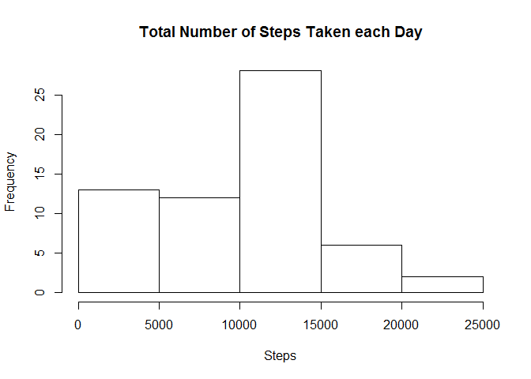
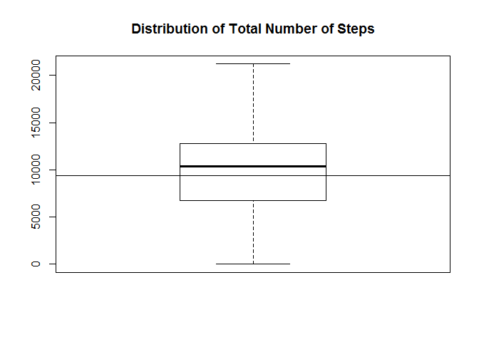
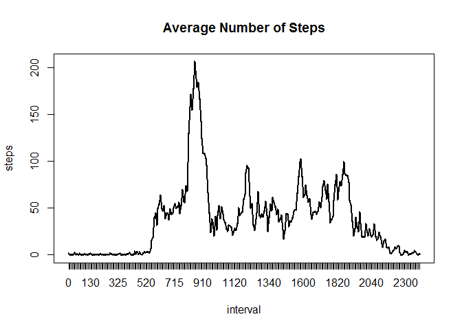
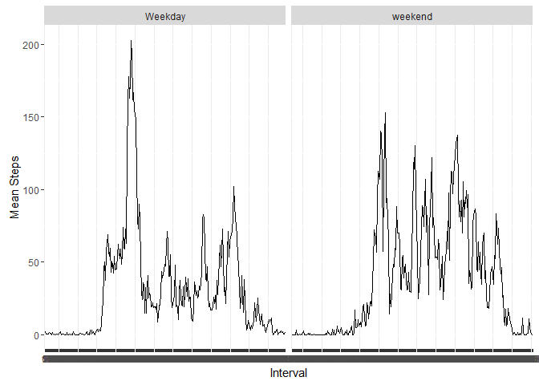

# Reproducible Research: Peer Assessment 1


## Loading and preprocessing the data


```r
#Loading the dataset
setwd("C:/Users/yousef/Desktop/Coursera")
df <- read.csv(file="activity.csv",header=T)
#Reformatting the variables
df$date <- as.Date(df$date,format="%Y-%m-%d")
df$interval <- as.factor(df$interval)
```


## What is mean total number of steps taken per day?

1. Make a histogram of the total number of steps taken each day

```r
#Calculating Total Steps
totalsteps <- sapply(split(df,df$date),function(x){sum(x[,1],na.rm=T)})
#Making a histogram
hist(totalsteps, main="Total Number of Steps Taken each Day",xlab = "Steps")
```


2. Calculate and report the **mean** and **median** total number of
   steps taken per day
   

```r
#Calculating the Mean and Median
quantile(totalsteps)[3]
```

```
##   50% 
## 10395
```

```r
mean(totalsteps)
```

```
## [1] 9354.23
```

```r
#Presenting this information visually
boxplot(totalsteps)
abline(h = mean(totalsteps))
title('Distribution of Total Number of Steps')
```



## What is the average daily activity pattern?

1. Make a time series plot (i.e. `type = "l"`) of the 5-minute
   interval (x-axis) and the average number of steps taken, averaged
   across all days (y-axis)


```r
averages <- aggregate(x=list(steps=df$steps), by=list(interval=df$interval),FUN=mean, na.rm=TRUE)
plot(averages,type="l")
lines(averages$interval,averages$steps,type="l",lwd=2)
title("Average Number of Steps")
```



2. Which 5-minute interval, on average across all the days in the
   dataset, contains the maximum number of steps?
   
 
 ```r
 averages$interval[which.max(averages$steps)]
 ```
 
 ```
 ## [1] 835
 ## 288 Levels: 0 5 10 15 20 25 30 35 40 45 50 55 100 105 110 115 120 ... 2355
 ```


## Imputing missing values

1. Calculate and report the total number of missing values in the
   dataset (i.e. the total number of rows with `NA`s)


```r
#Reporting missing values
sum(is.na(df))
```

```
## [1] 2304
```

```r
#Size of the dataset
dim(df)
```

```
## [1] 17568     3
```
2. Devise a strategy for filling in all of the missing values in the
   dataset. The strategy does not need to be sophisticated. For
   example, you could use the mean/median for that day, or the mean
   for that 5-minute interval, etc.
   
I will use the median number of steps to impute the missing values.

3. Create a new dataset that is equal to the original dataset but with
   the missing data filled in.


```r
library(Hmisc)
```

```
## Warning: package 'Hmisc' was built under R version 3.1.3
```

```
## Loading required package: lattice
```

```
## Warning: package 'lattice' was built under R version 3.1.3
```

```
## Loading required package: survival
```

```
## Warning: package 'survival' was built under R version 3.1.3
```

```
## Loading required package: Formula
```

```
## Warning: package 'Formula' was built under R version 3.1.3
```

```
## Loading required package: ggplot2
```

```
## Warning: package 'ggplot2' was built under R version 3.1.3
```

```
## 
## Attaching package: 'Hmisc'
```

```
## The following objects are masked from 'package:base':
## 
##     format.pval, round.POSIXt, trunc.POSIXt, units
```

```r
imputed <- df
imputed$steps <- impute(imputed$steps,median)
```
4. Make a histogram of the total number of steps taken each day and
   Calculate and report the **mean** and **median** total number of
   steps taken per day. Do these values differ from the estimates from
   the first part of the assignment? What is the impact of imputing
   missing data on the estimates of the total daily number of steps?


```r
#Compute Summary Stats for imputed
totalsteps <- sapply(split(imputed,imputed$date),function(x){sum(x[,1],na.rm=T)})
hist(totalsteps, main="Total Number of Steps Taken each Day",xlab = "Steps")
```


```r
median(totalsteps)
```

```
## [1] 10395
```

```r
mean(totalsteps)
```

```
## [1] 9354.23
```

```r
boxplot(totalsteps)
abline(h = mean(totalsteps))
title('Distribution of Total Number of Steps')
```


 Using this method of imputation, these values do not differ from the complete
  case analysis. With this method of imputation, it is difficult to calculate
  any error for our estimate. Multiple Imputation (via the MICE package) is
  one way to impute missing values and compute standard errors for our estimates.
  It's a little bit beyond this assignment, so let's just say our estimates
  did not change and leave it at that.
   
## Are there differences in activity patterns between weekdays and weekends?

1. Create a new factor variable in the dataset with two levels --
   "weekday" and "weekend" indicating whether a given date is a
   weekday or weekend day.
   

```r
indicator <- weekdays(imputed$date) %in% c("Saturday","Sunday")
indicator <- as.factor(indicator)
levels(indicator) <- c("Weekday","weekend")
imputed$indicator <- indicator
```
 
2. Make a panel plot containing a time series plot (i.e. `type = "l"`)
   of the 5-minute interval (x-axis) and the average number of steps
   taken, averaged across all weekday days or weekend days
   (y-axis).
   
   

```r
library(plyr)
```

```
## Warning: package 'plyr' was built under R version 3.1.3
```

```
## 
## Attaching package: 'plyr'
```

```
## The following objects are masked from 'package:Hmisc':
## 
##     is.discrete, summarize
```

```r
imputed2 <- ddply(imputed, .(interval, indicator), summarise, average=mean(steps))
library(ggplot2)
g <- ggplot(imputed2,aes(interval,average,group=indicator))
g + geom_line() + facet_grid(.~indicator) + labs(y="Mean Steps",x="Interval")
```


